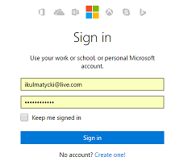
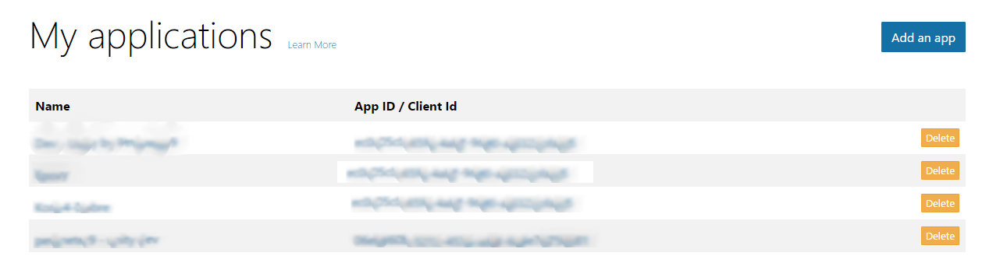
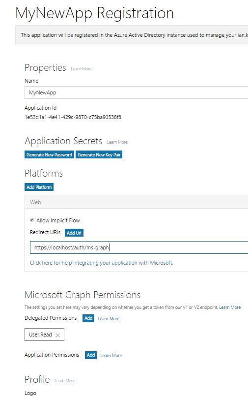

#  ServiceStack.Authentication.Azure

[](https://www.myget.org/)

Azure Active Directory via Azure Graph for ServiceStack

### Kudos
First off I would like to really thank [@jfoshee](https://github.com/jfoshee) for his work enabling authentication with 
Azure through the awesome [ServiceStack.Authentication.Aad library](https://github.com/jfoshee/ServiceStack.Authentication.Aad). 
If you haven't checked it out yet, you should. A lot (most) of the details for working with azure remain 
similiar or unchanged. You will notice @jfoshee referenced throughout the source. 

### Getting Started
For the majority of you who aren't my Mom and are uninterested in reading my rambling, just 
fire it up and follow the steps here.

## Azure v2.0 Endpoint
In a nutshell, Microsoft has converged the authentication scenarios of personal Microsoft 
accounts and Azure Active Directory, 
[tl;dr version](https://azure.microsoft.com/en-us/documentation/articles/active-directory-appmodel-v2-overview/). 
My feeling is that this is a good thing, one API to rule them all. This is also why I whipped 
up this project vs forking the original. In now way is one better than the other, they are 
just different in my opinion ergo separate repo.
That being said, I created this repo to authenticate users with Office365 and hybrid Azure 
Active Directories.


## Configuring Azure
Before allowing users of your ServiceStack app to authenticate using the Azure Graph API
you must first let Azure know about your app. This process is known as 'Registering your 
App with Azure'. This process has been streamlined. It's easy.

1. Navigate to [https://apps.dev.microsoft.com/Landing](https://apps.dev.microsoft.com/Landing) and 
log in with your credentials. Remember to log in under the account that you wish to grant app 
access to, either your microsoft account, or your directory (AAD/Office 365) account. In order 
to grant access to your directory you will need sufficient permissions, likely god of gods.

      

2. Once authenticated you will be on your 'My Applications' page. This page displays a list of 
apps that you have already granted access too. Click the 'Add an app' button on the top
 right.

   

3. You will be prompted to enter a name for your app. Enter the name of your 
ServiceStack app. Like 'My New App'. You are then presented with the configuration screen for your app authentication.
These are the items you care about:
    1. Application Id: This is the value that uniquely identifies your application. You will need this value 
    and will use it in your servicestack app.
    
    2. Application Secrets: You will need to generate a new password. BEWARE! This value is 
    displayed to you only once. Once you dismiss it from your screen you will never see 
    it again. When you are presented with this value make a note of it for later.
    
    3. Platforms: We are the web. Select the web platform. When you select the web platform 
    you are then able to enter redirect Urls. Redirect Urls is the url that Azure 
    will post back to once it has authenticated you user. It  should have the form of 
    https://{yourservicestackapp}/auth/ms-graph. NOTE that https is a requirement which 
    can be a pain. Good news is that .net core supports ssl certs really easily. If you 
    need help google it or drop me a line and I can try help you out.

    4. Microsoft Graph Permissions: This defines what things you are allowing your ServiceStack 
    app to access. With the new api, a lot of things are openning up. For a good reference you 
    can check out [https://azure.microsoft.com/en-us/documentation/articles/active-directory-v2-scopes/](https://azure.microsoft.com/en-us/documentation/articles/active-directory-v2-scopes/).

       

        Thats about it! Azure is now expecting authentication requests from your app. Now the 
next part of the solution is configuring your app.

## Configuring ServiceStack Azure Authentication

In order for your ServiceStack app to authenticate users against their directory, 
we must inform Azure of a couple pieces of data. These include your application id, 
your password (or client secret) that you copied down earlier. In addition we will 
send the account name entered on your app along to help Azure.

ServiceStack.Authentication.Azure keeps track of Azure domains in a registry. As such, 
there are several IApplicationRegistryService implementations available to you out of 
the box. The SingleTenantApplicationRegistryService will attempt to authenticate all 
authentication requests to the same directory. This directory is specified by values 
fed into the provider instance.

The AzureAuthenticationProvider is configured in the already familiar pattern as 
all other existing providers.

```

...
app.Plugins.Add(
    new AuthFeature(() => new AuthUserSession(), 
    new IAuthProvider[]
    {
        new AzureGraphAuthenticationProvider(), 
    }));
...

```

In addition, you must register the IApplicationRegistryService in the container. I know 
its a bit of a pain, however this allows us to use the provider in both a single and 
multi-tenant environment. 

```
...
autoFac.Register<IApplicationRegistryService>(
    c => SingleTenantApplicationRegistryService(
            new AzureDirectorySettings
            {
                ClientId = "<ApplicationId From App Registration Page>",
                ClientSecret = "<Super secret password generated on App Reg. Page>",
                DirectoryName = "<Azure directory name i.e. contoso.com>"
            }));
...            
    
```

In order to authenticate with Azure now, you simply follow the existing pattern of 
sending an Authenticate request, specifying  the ms-graph provider.

```

...
var auth = new Authenticate {
    provider = "ms-graph",
    UserName = "user@mydirectory.com"
};
...

```

It is important that the fully qualified username be submitted. For now, unless there 
is a reason to change it, even in single tenant mode you must specify the '@mydirectory.com' 
part of the username.

Thats it!!
After submitting the Authenticate request, the expected flow for oauth will proceed 
without suprises. If you are having problems drop me a line.


## Configuring Multi Tenant Support

First, multi-tenant support in this context simply means that you want to allow users 
from more than a single directory to access your ServiceStack app. This is a common 
requirement for things like SaaS apps/backends.

In order to support multi-tenant authentication you simply need to use an
IApplicationRegistryService that supports looking up directories by the 
username submitted with the Authenticate request.

Already implemented is the OrmLiteMultiTenantApplicationRegistryService. This 
implementation backs onto the existing OrmLite support built right into 
ServiceStack and stores/queries directories in the database. 

```

...
app.Plugins.Add(
    new AuthFeature(() => new AuthUserSession(), 
    new IAuthProvider[]
    {
        new AzureGraphAuthenticationProvider(new TestAzureGraphService()), 
    }));

var container = host.GetContainer();
container.Register<IDbConnectionFactory>(
    new OrmLiteConnectionFactory(":memory:", SqliteDialect.Provider));
autoFac.Register<IApplicationRegistryService>(
    c => new OrmLiteMultiTenantApplicationRegistryService(c.Resolve<IDbConnectionFactory>()));

...
```